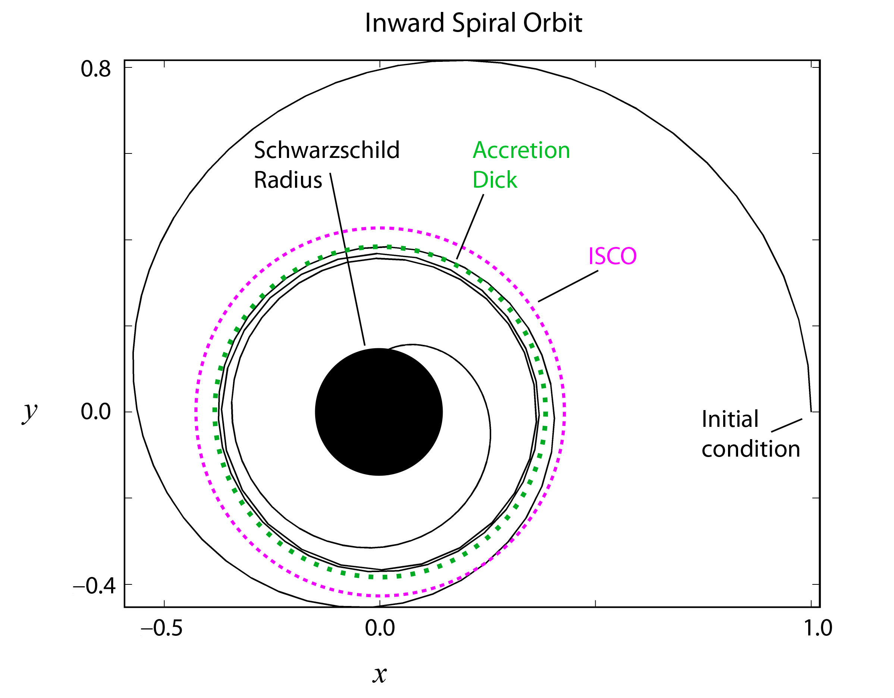
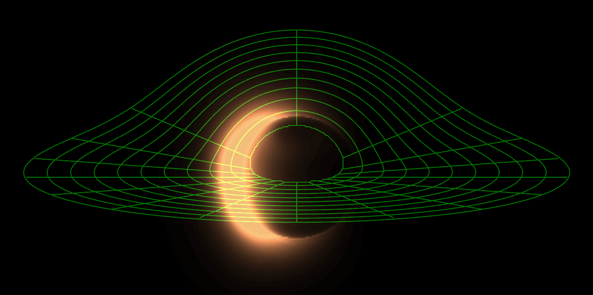

# Accretion Disk Shape

The accretion disk around a black hole is a flattened, rotating structure of gas and dust spiraling inward due to gravity. Its shape and inner edge are determined by the black hole's mass, spin, and the laws of general relativity.



## Disk Geometry

- The disk is typically modeled as a thin, equatorial ring in the $x$ - $z$ plane (perpendicular to the spin axis).
- The disk extends from an inner radius $r_{\text{in}}$ to an outer radius $r_{\text{out}}$.

## Inner Edge: ISCO (Innermost Stable Circular Orbit)

The inner edge of the disk is set by the ISCO, which depends on the black hole's spin $a$:

```math
r_{\text{ISCO}} = 3 + Z_2 - \text{sign}(a) \sqrt{(3 - Z_1)(3 + Z_1 + 2 Z_2)}
```
where:
```math
Z_1 = 1 + (1 - a^2)^{1/3} \left[ (1 + a)^{1/3} + (1 - a)^{1/3} \right]
```
```math
Z_2 = \sqrt{3 a^2 + Z_1^2}
```
- For a non-rotating (Schwarzschild) black hole ($a = 0$): $r_{\text{ISCO}} = 6M$
- For a maximally rotating (prograde, $a = +1$): $r_{\text{ISCO}} = M$
- For a maximally rotating (retrograde, $a = -1$): $r_{\text{ISCO}} = 9M$

## Disk Thickness

The disk is often assumed to be geometrically thin:
```math
H(r) \ll r
```
where $H(r)$ is the disk's vertical height at radius $r$.

## Disk Surface

The surface of the disk in the equatorial plane is:
```math
y = 0, \quad r_{\text{ISCO}} \leq \sqrt{x^2 + z^2} \leq r_{\text{out}}
```

## Relativistic Effects

- **Frame dragging** (in Kerr metric) causes the disk's inner edge to move closer to the black hole for prograde orbits.
- **Gravitational lensing** bends light from the far side of the disk, making the disk appear warped and asymmetric to a distant observer. 

## Disk Bending and Gravitational Lensing

The strong gravity of a black hole bends the paths of light rays coming from the accretion disk. This effect, called gravitational lensing, causes the far side of the disk to appear above and below the black hole, creating the characteristic "photon ring" and warped appearance seen in simulations.



The deflection angle $\alpha$ for a light ray passing at a distance $b$ (impact parameter) from a Schwarzschild black hole is approximately:

```math
\alpha \approx \frac{4GM}{c^2 b}
```
where:
- $G$ is the gravitational constant
- $M$ is the black hole mass
- $c$ is the speed of light
- $b$ is the impact parameter (closest approach)

For light passing very close to the event horizon, the bending becomes extreme and requires full general relativity to describe. This strong lensing is responsible for the multiple images and the highly bent appearance of the accretion disk near the black hole. 

