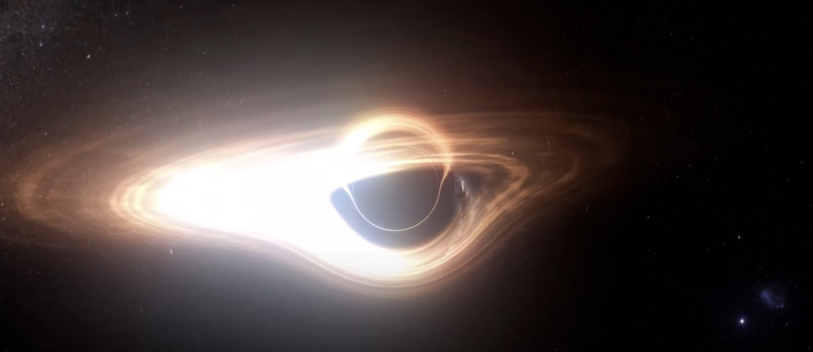

# Doppler Shift

The simulation includes the relativistic Doppler effect, which shifts the observed frequency and intensity of light due to the relative motion between the observer and the emitting material (e.g., the accretion disk).



The doppler effect in black holes consists in some visible effects:
- the part of the accretion disk that moves towards the observer is brighter and bluer. ("blue boosting")
- the part of the accretion disk that moves away from the observer appears dimmer and redder ("red de-boosting").

This creates an overall asymmetry in the appearance of the accretion disk.
  
Other aspects of the extreme conditions close to the event horizon affect the final result of the doppler shift, such as the time dilation which makes the inner part of the disk slower, blurred and redder.

Relativistic speeds of the material in the accretion disk make the Doppler effect more intense and dramatic.

## Relativistic Doppler Factor

The Doppler factor for a source moving with velocity $\vec{v}$ relative to the observer is:
```math
D = \gamma (1 + \vec{n} \cdot \vec{v})
```
where:
- $\gamma = \frac{1}{\sqrt{1 - v^2}}$ is the Lorentz factor
- $\vec{n}$ is the direction from the source to the observer (unit vector)
- $\vec{v}$ is the velocity of the emitting material (in units where $c = 1$)

## Observed Frequency and Intensity
- The observed frequency is shifted by the Doppler factor:
```math
\nu_{\text{obs}} = D \; \nu_{\text{emit}}
```
- The observed intensity is boosted by:
```math
I_{\text{obs}} = \frac{I_{\text{emit}}}{D^3}
```

These formulas produce the characteristic blue shift (brightening) on the approaching side of the disk and red shift (dimming) on the receding side, as seen in the visualization.