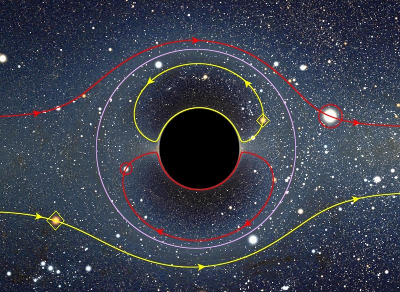
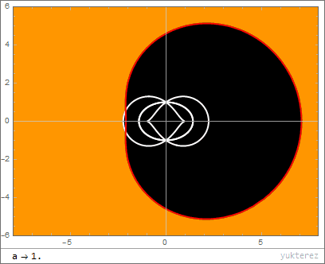

# Gravitational Lensing

The simulation traces the path of light (null geodesics) in the curved spacetime around a black hole. For a rotating (Kerr) black hole, the equations of motion are derived from the Kerr metric. The photon's position and velocity are updated using a leapfrog integration scheme.



## Geodesic Integration

The equations of motion for a photon in the Kerr metric are integrated step by step:

- The position and velocity of the photon are updated according to the local spacetime curvature.
- The acceleration is computed from the effective potential derived from the Kerr metric.

## Distortion from a Spinning (Kerr) Black Hole

A spinning (Kerr) black hole dramatically distorts the appearance of its surroundings due to the effects of frame dragging and the asymmetry of its event horizon.

Unlike a non-rotating (Schwarzschild) black hole, which produces a perfectly circular shadow, a Kerr black hole’s shadow appears “D-shaped” or lopsided to a distant observer. This distortion is caused by the dragging of spacetime around the black hole’s spin axis, which bends the paths of photons more strongly on the side rotating toward the observer. As a result, the photon ring and the shadow are shifted and compressed on the prograde (co-rotating) side and stretched on the retrograde (counter-rotating) side.

The degree of asymmetry increases with the black hole’s spin, providing a direct observational signature of rotation in black hole images.

## Kerr Metric Effects

The Kerr metric in Boyer-Lindquist coordinates is:
```math
ds^2 = -\left(1 - \frac{2Mr}{\rho^2}\right) dt^2 - \frac{4Mar\sin^2\theta}{\rho^2} dt d\phi + \frac{\rho^2}{\Delta} dr^2 + \rho^2 d\theta^2 + \left(r^2 + a^2 + \frac{2Ma^2 r \sin^2\theta}{\rho^2}\right) \sin^2\theta d\phi^2
```
where:
```math
\rho^2 = r^2 + a^2 \cos^2\theta
\Delta = r^2 - 2Mr + a^2
```
- `a` is the dimensionless spin parameter (0 for Schwarzschild, up to 1 for maximally rotating)
- `M` is the black hole mass (set to 1 in code units)



## Frame Dragging and Radial Effects
- The frame dragging angular velocity:
```math
\omega = -\frac{2 a r}{\rho^2 (\rho^2 + 2 r)}
```
- The radial correction factor:
```math
\text{radial\_factor} = 1 + \frac{a^2 \cos^2\theta}{r^4}
```

These formulas govern how light bends and orbits around the black hole, producing the characteristic lensing and shadow effects seen in the visualization.

