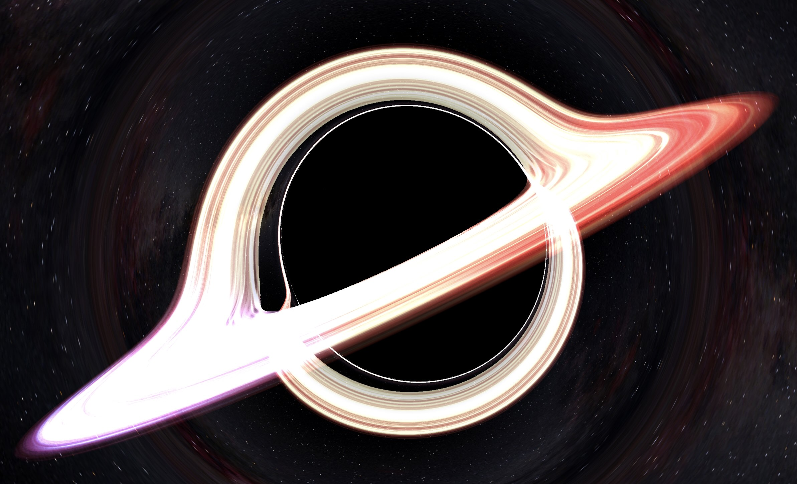

# Black Hole Visualization

A real-time 3D visualization of a black hole using React, Three.js, and GLSL shaders. This project simulates gravitational lensing, accretion disk effects, and relativistic beaming around a black hole, inspired by scientifically accurate black hole renderings.


## Screenshot



## Features

- Real-time gravitational lensing simulation
- Accretion disk with multiple texture options
  - natural
  - arrows
  - stripes
  - grid
  - blue
- Doppler shift effect
- Relativistic beaming effect
- Photon ring at the event horizon
- Rotation to simulate a Kerr black hole
  - frame dragging effect
- Customizable glow effects
- Interactive camera controls with orbit mode
- Performance quality adjustment
- Post-processing effects:
  - Bloom with adjustable intensity
  - Glow with customizable parameters
- Background options:
  - Star field with proper parallax
  - Milky Way background
- Persistent settings using local storage

## Technologies Used

- React + TypeScript
- Three.js
- React Three Fiber
- GLSL Shaders
- Vite
- Local Storage for persistent settings

## Getting Started

### Prerequisites

- Node.js (v20 or higher)
- npm or yarn

### Installation

1. Clone the repository:
```bash
git clone https://github.com/rmarchet/blackhole-ts.git
cd blackhole-ts
```

2. Install dependencies:
```bash
npm install
# or
yarn install
```

3. Start the development server:
```bash
npm run dev
# or
yarn dev
```

4. Open your browser and navigate to `http://localhost:5173`

## Controls

### Camera Controls
- Left-click + drag: Rotate camera
- Right-click + drag: Pan camera
- Mouse wheel: Zoom in/out
- Toggle orbit mode for automatic camera rotation

### Visual Controls
- Performance Quality:
  - High quality: More accurate ray marching steps
  - Low quality: Better performance
- Bloom Effect:
  - Adjustable intensity
  - Configurable threshold and radius
- Glow Effect:
  - Toggle glow
  - Adjustable intensity
- Accretion Disk:
  - Multiple texture options
  - Adjustable intensity
  - Toggle Doppler shift
- Background:
  - Toggle star field
  - Toggle Milky Way
  - Adjustable background intensity

## How It Works

The visualization uses advanced ray marching techniques in GLSL shaders to simulate:
- Gravitational lensing around the black hole using geodesic calculations
- Accretion disk with realistic Doppler and relativistic effects
- Photon ring at the event horizon
- Relativistic beaming and light aberration
- Star field background with proper parallax
- Post-processing effects for enhanced visual quality

## Gravitational Lensing

The simulation traces the path of light (null geodesics) in the curved spacetime around a black hole. For a rotating (Kerr) black hole, the equations of motion are derived from the Kerr metric. The photon's position and velocity are updated using a leapfrog integration scheme.

**Geodesic Integration:**

The equations of motion for a photon in the Kerr metric are integrated step by step:

- The position and velocity of the photon are updated according to the local spacetime curvature.
- The acceleration is computed from the effective potential derived from the Kerr metric.

**Kerr Metric Effects:**

The Kerr metric in Boyer-Lindquist coordinates is:
```math
ds^2 = -\left(1 - \frac{2Mr}{\rho^2}\right) dt^2 - \frac{4Mar\sin^2\theta}{\rho^2} dt d\phi + \frac{\rho^2}{\Delta} dr^2 + \rho^2 d\theta^2 + \left(r^2 + a^2 + \frac{2Ma^2 r \sin^2\theta}{\rho^2}\right) \sin^2\theta d\phi^2
```
where:
```math
\rho^2 = r^2 + a^2 \cos^2\theta
\Delta = r^2 - 2Mr + a^2
```
- `a` is the dimensionless spin parameter (0 for Schwarzschild, up to 1 for maximally rotating)
- `M` is the black hole mass (set to 1 in code units)

**Frame Dragging and Radial Effects:**
- The frame dragging angular velocity:
```math
\omega = -\frac{2 a r}{\rho^2 (\rho^2 + 2 r)}
```
- The radial correction factor:
```math
\text{radial\_factor} = 1 + \frac{a^2 \cos^2\theta}{r^4}
```

These formulas govern how light bends and orbits around the black hole, producing the characteristic lensing and shadow effects seen in the visualization.

### Doppler Shift

The simulation includes the relativistic Doppler effect, which shifts the observed frequency and intensity of light due to the relative motion between the observer and the emitting material (e.g., the accretion disk).

**Relativistic Doppler Factor:**

The Doppler factor for a source moving with velocity $\vec{v}$ relative to the observer is:
```math
D = \gamma (1 + \vec{n} \cdot \vec{v})
```
where:
- $\gamma = \frac{1}{\sqrt{1 - v^2}}$ is the Lorentz factor
- $\vec{n}$ is the direction from the source to the observer (unit vector)
- $\vec{v}$ is the velocity of the emitting material (in units where $c = 1$)

**Observed Frequency and Intensity:**
- The observed frequency is shifted by the Doppler factor:
```math
\nu_{\text{obs}} = D \; \nu_{\text{emit}}
```
- The observed intensity is boosted by:
```math
I_{\text{obs}} = \frac{I_{\text{emit}}}{D^3}
```

These formulas produce the characteristic blue shift (brightening) on the approaching side of the disk and red shift (dimming) on the receding side, as seen in the visualization.

## Project Structure

- `src/components/`: React components including the main BlackHole component
- `src/shaders/`: GLSL shader code for the visualization
- `src/hooks/`: Custom React hooks for state management
- `src/constants/`: Configuration and constant values
- `src/assets/`: Textures and static assets

## License

This project is licensed under the MIT License - see the [LICENSE](LICENSE) file for details.

## Acknowledgments

- Inspired by the work of Kip Thorne and the visual effects team of "Interstellar"
- Based on scientific papers about black hole visualization
- Thanks to the Three.js and React Three Fiber communities
